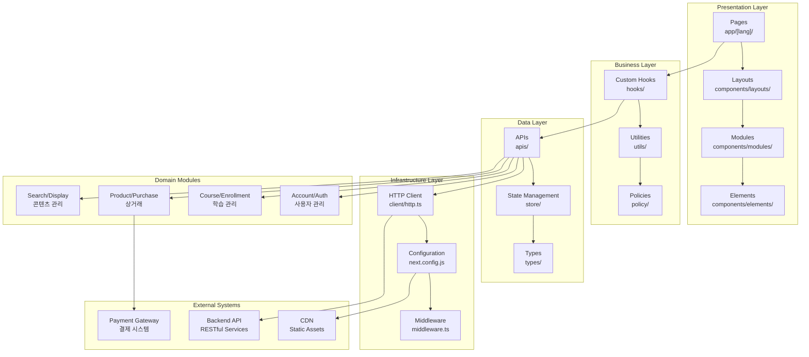

# 콜로소 DevBrother2 아키텍처 문서

## 📚 문서 개요

이 문서는 **콜로소(Coloso) DevBrother2** 프로젝트의 전체 아키텍처를 분석하고 정리한 문서 모음입니다. 온라인 강의 플랫폼 클라이언트 애플리케이션의 구조, 설계 결정사항, 그리고 각 모듈의 역할과 책임을 체계적으로 다룹니다.

## 📋 문서 구성

### 1. [프로젝트 아키텍처 분석](./project-architecture-analysis.md)

- **프로젝트 개요 및 핵심 특징**
- **전체 아키텍처 패턴 식별**
- **기술 스택 아키텍처**
- **모듈 구성 및 비즈니스 도메인 분석**
- **데이터 플로우 및 성능 최적화**

### 2. [모듈별 역할 매트릭스](./module-responsibility-matrix.md)

- **레이어별 모듈 분류 및 책임**
- **비즈니스 도메인별 모듈 매핑**
- **컴포넌트 계층 구조**
- **모듈 간 상호작용 패턴**
- **개선 권장사항**

### 3. [주요 설계 결정사항 요약](./design-decisions-summary.md)

- **핵심 아키텍처 결정사항**
- **기술적 설계 결정사항**
- **설계 결정 영향 분석**
- **트레이드오프 분석**
- **설계 원칙 요약**

## 🎯 주요 분석 결과

### 아키텍처 패턴

- **Layered Architecture**: 계층형 구조로 관심사 분리
- **Component-Based Architecture**: Atomic Design 패턴 적용
- **Domain-Driven Design**: 비즈니스 도메인별 모듈 분리

### 기술 스택

- **Frontend**: Next.js 14 (App Router) + React 18 + TypeScript
- **상태 관리**: Valtio (클라이언트) + TanStack Query (서버)
- **스타일링**: Emotion (CSS-in-JS) + SCSS
- **다국어**: URL 기반 라우팅 (`/[lang]/page`)

### 비즈니스 도메인

1. **사용자 관리**: Account, Auth, User
2. **학습 관리**: Course, Enrollment, Classroom
3. **상거래**: Product, Purchase, Order, Payment, Voucher
4. **콘텐츠 관리**: Display, Banner, Search, Category

## 🏗️ 고수준 아키텍처 다이어그램

## 📊 아키텍처 품질 평가

| 품질 속성      | 수준       | 달성 방법                        |
| -------------- | ---------- | -------------------------------- |
| **확장성**     | ⭐⭐⭐⭐   | 모듈형 구조, 도메인 분리         |
| **유지보수성** | ⭐⭐⭐⭐⭐ | 계층형 아키텍처, 타입 안전성     |
| **성능**       | ⭐⭐⭐⭐   | 캐싱, 코드 스플리팅, SSR         |
| **사용성**     | ⭐⭐⭐⭐⭐ | 반응형 디자인, 다국어 지원       |
| **보안**       | ⭐⭐⭐     | 타입 안전성, 정책 기반 접근 제어 |

## 🚀 핵심 설계 원칙

1. **단순성 우선** - 복잡한 패턴보다 직관적인 구조
2. **관심사 분리** - 레이어별 명확한 책임 분리
3. **확장성 고려** - 미래 요구사항 변화 대응
4. **성능 최적화** - 사용자 경험 우선
5. **개발자 경험** - 타입 안전성과 일관된 패턴

## 🎓 학습 목적

이 문서는 다음과 같은 학습 목적으로 활용할 수 있습니다:

- **아키텍처 설계**: 대규모 프론트엔드 애플리케이션 구조 설계
- **기술 선택**: 각 기술 스택의 선택 근거와 트레이드오프 이해
- **모듈 설계**: 도메인 기반 모듈 분리와 계층형 구조 적용
- **성능 최적화**: Next.js 기반 웹 애플리케이션 최적화 전략
- **팀 협업**: 대규모 프로젝트에서의 코드 구조와 협업 방식

## 📝 문서 업데이트

- **최초 작성**: 2024년
- **대상 독자**: 프론트엔드 개발자, 아키텍트, 기술 리더
- **업데이트 주기**: 프로젝트 구조 변경 시

## 🔗 관련 자료

- [콜로소 공식 사이트](https://coloso.co.kr)
- [Next.js 공식 문서](https://nextjs.org/docs)
- [React 공식 문서](https://react.dev)
- [TypeScript 공식 문서](https://www.typescriptlang.org)

---

_이 문서는 콜로소 DevBrother2 프로젝트의 아키텍처 이해를 돕기 위해 작성되었습니다._
_프로젝트의 구조와 설계 결정사항을 학습하고 참고하는 용도로 활용해 주세요._
