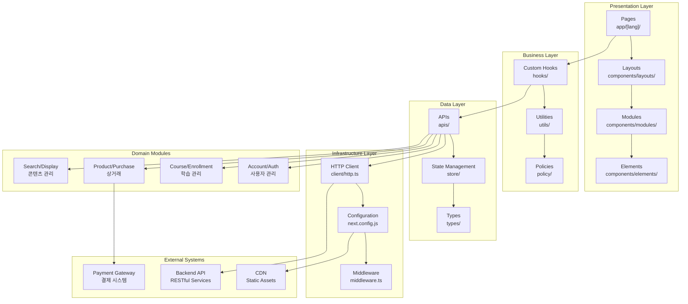

# 콜로소 DevBrother2 프로젝트 아키텍처 분석

## 📋 프로젝트 개요

**콜로소(Coloso) DevBrother2**는 온라인 강의 플랫폼의 클라이언트 애플리케이션으로, Next.js 14 기반의 현대적인 웹 애플리케이션입니다.

### 핵심 특징

- 🎯 **비즈니스 도메인**: 온라인 강의 플랫폼 (강의 구매, 학습 관리, 사용자 계정)
- 🌐 **다국어 지원**: 한국어, 영어, 중국어(번체)
- 📱 **반응형 디자인**: 모바일/데스크톱 대응
- 🔄 **실시간 상태 관리**: Valtio + TanStack Query

## 🏗️ 전체 아키텍처 패턴

### 1. **Layered Architecture (계층형 아키텍처)**

```
┌─────────────────────────────────────┐
│           Presentation Layer        │  ← 페이지, 컴포넌트
├─────────────────────────────────────┤
│            Business Layer           │  ← 훅, 유틸리티
├─────────────────────────────────────┤
│             Data Layer              │  ← API, 상태 관리
├─────────────────────────────────────┤
│          Infrastructure Layer       │  ← HTTP 클라이언트, 정책
└─────────────────────────────────────┘
```

### 2. **Component-Based Architecture**

- **Atomic Design 패턴** 적용
- **관심사 분리**: Elements → Layouts → Modules → Templates
- **재사용성 극대화**: 공통 컴포넌트 중심 설계

### 3. **Domain-Driven Design (DDD) 요소**

비즈니스 도메인별 모듈 분리:

- **Account/Auth**: 계정 관리 및 인증
- **Course/Enrollment**: 강의 및 수강 관리
- **Product/Purchase/Order**: 상품 및 결제
- **Search/Display**: 검색 및 콘텐츠 표시
- **Voucher/Exchange**: 쿠폰 및 교환

## 🔧 기술 스택 아키텍처

### Frontend Framework

- **Next.js 14**: App Router, SSR/SSG 지원
- **React 18**: 컴포넌트 기반 UI
- **TypeScript**: 정적 타입 검사

### 상태 관리

- **Valtio**: 클라이언트 상태 (Proxy 기반)
- **TanStack Query**: 서버 상태 (캐싱, 동기화)

### 스타일링

- **Emotion**: CSS-in-JS
- **SCSS**: CSS 전처리기
- **Theme System**: 일관된 디자인 시스템

### 개발 도구

- **ESLint + Prettier**: 코드 품질 관리
- **SVGR**: SVG 컴포넌트 자동 생성

## 📁 모듈 구성 분석

### 최상위 디렉토리 역할

| 디렉토리      | 역할                | 책임                                |
| ------------- | ------------------- | ----------------------------------- |
| `app/`        | **라우팅 & 페이지** | Next.js App Router 기반 페이지 정의 |
| `components/` | **UI 컴포넌트**     | 재사용 가능한 컴포넌트 라이브러리   |
| `apis/`       | **데이터 레이어**   | 외부 API 통신 로직                  |
| `store/`      | **상태 관리**       | 전역 상태 관리 (Valtio)             |
| `hooks/`      | **비즈니스 로직**   | 재사용 가능한 커스텀 훅             |
| `types/`      | **타입 정의**       | TypeScript 타입 및 인터페이스       |
| `utils/`      | **유틸리티**        | 공통 함수 및 헬퍼                   |
| `styles/`     | **스타일링**        | 전역 스타일 및 테마                 |
| `policy/`     | **정책 & 설정**     | 비즈니스 규칙 및 설정값             |

### 비즈니스 도메인 분석

#### 1. **사용자 관리 도메인**

- **Account**: 사용자 계정 정보 관리
- **Auth**: 인증 및 권한 관리
- **User**: 사용자 프로필 및 설정

#### 2. **학습 관리 도메인**

- **Course**: 강의 정보 및 메타데이터
- **Enrollment**: 수강 신청 및 진행 상황
- **Classroom**: 온라인 학습 환경

#### 3. **상거래 도메인**

- **Product**: 상품(강의) 정보
- **Purchase**: 구매 프로세스
- **Order**: 주문 관리
- **Payment**: 결제 처리
- **Voucher**: 쿠폰 및 할인

#### 4. **콘텐츠 관리 도메인**

- **Display**: 콘텐츠 표시 및 큐레이션
- **Banner**: 배너 및 프로모션
- **Search**: 검색 및 필터링
- **Category**: 카테고리 분류

## 🔄 데이터 플로우

### 1. **사용자 요청 처리**

```
사용자 입력 → 컴포넌트 → 훅 → API → 서버 → 응답 → 상태 업데이트 → UI 리렌더링
```

### 2. **상태 관리 플로우**

```
서버 상태 (TanStack Query) ←→ 컴포넌트 ←→ 클라이언트 상태 (Valtio)
```

### 3. **라우팅 플로우**

```
URL 변경 → Next.js Router → 언어 감지 → 페이지 렌더링 → 레이아웃 적용
```

## 🎯 주요 설계 결정사항

### 1. **아키텍처 선택**

- **Next.js App Router**: 최신 라우팅 시스템으로 성능 최적화
- **Valtio**: 간단하고 직관적인 상태 관리
- **TanStack Query**: 서버 상태 캐싱 및 동기화

### 2. **컴포넌트 구조**

- **계층형 컴포넌트**: Elements → Layouts → Modules → Templates
- **테마 시스템**: 스타일과 로직 분리
- **동적 임포트**: 성능 최적화를 위한 코드 스플리팅

### 3. **다국어 지원**

- **URL 기반 라우팅**: `/[lang]/page` 구조
- **메타데이터 지역화**: SEO 최적화

### 4. **성능 최적화**

- **이미지 최적화**: 커스텀 이미지 로더
- **번들 최적화**: 동적 임포트 및 코드 스플리팅
- **캐싱 전략**: React Query 기반 서버 상태 캐싱

## 📊 아키텍처 품질 속성

| 품질 속성      | 달성 방법                        | 수준       |
| -------------- | -------------------------------- | ---------- |
| **확장성**     | 모듈형 구조, 도메인 분리         | ⭐⭐⭐⭐   |
| **유지보수성** | 계층형 아키텍처, 타입 안전성     | ⭐⭐⭐⭐⭐ |
| **성능**       | 캐싱, 코드 스플리팅, SSR         | ⭐⭐⭐⭐   |
| **사용성**     | 반응형 디자인, 다국어 지원       | ⭐⭐⭐⭐⭐ |
| **보안**       | 타입 안전성, 정책 기반 접근 제어 | ⭐⭐⭐     |

---



_이 문서는 콜로소 DevBrother2 프로젝트의 아키텍처 분석 결과를 담고 있습니다._
_최종 업데이트: 2024년_
